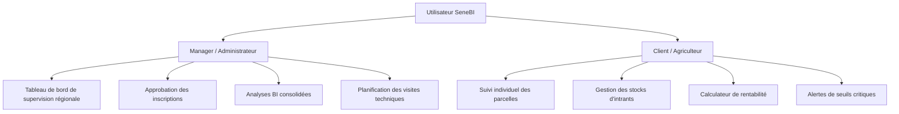

# SeneBI — Guide de l'Utilisateur et Présentation Globale

SeneBI est une plateforme moderne de **Business Intelligence (BI) Agricole** conçue pour optimiser le suivi, l'analyse et la prise de décision au sein des exploitations agricoles au Sénégal. Ce document présente le fonctionnement global de la plateforme, ses fonctionnalités clés et ses cas d'utilisation pour chaque type d'utilisateur.

---

## 👥 Rôles et Espaces Utilisateurs

La plateforme SeneBI s'articule autour de deux rôles principaux ayant des accès et des objectifs distincts :

### 1. L'Espace Manager (Administration)
Le Manager a une vision macroscopique et analytique. Ses missions principales sont :
* **Supervision des agriculteurs :** Valider ou rejeter les nouvelles demandes d'inscription d'agriculteurs.
* **Planification des visites :** Planifier et enregistrer les visites techniques sur le terrain auprès des agriculteurs.
* **Analyses décisionnelles :** Consulter des graphiques interactifs sur la rentabilité globale, les rendements moyens par culture et les répartitions géographiques.
* **Gestion des alertes :** Identifier instantanément les agriculteurs à risque (ceux subissant des rendements anormalement bas ou manquant de visites de supervision récentes).

### 2. L'Espace Client (Agriculteur)
L'Agriculteur gère son exploitation au quotidien. Ses fonctionnalités incluent :
* **Gestion des parcelles :** Enregistrer ses parcelles géolocalisées, y associer des cultures (Riz, Maïs, Coton) et y suivre les semis.
* **Gestion des stocks :** Suivre les quantités disponibles d'intrants (Engrais NPK, Urée, Semences, Pesticides, Herbicides) et recevoir des alertes visuelles si les stocks passent sous un seuil critique.
* **Calculateur de rentabilité :** Enregistrer ses récoltes et analyser la rentabilité financière de chaque parcelle (Revenus - Coût des intrants - Coûts opérationnels).

---

## 🌟 Fonctionnalités Majeures de la Plateforme

### 1. Inscription et Processus d'Approbation Sécurisé
Pour garantir la qualité et la sécurité des données, l'inscription d'un nouvel agriculteur suit un workflow rigoureux :
1. L'agriculteur s'inscrit via le portail public (`/register`) en fournissant ses coordonnées et la localisation de son exploitation.
2. Le compte est créé avec le statut **`pending` (en attente)** et est temporairement inactif.
3. Un manager reçoit une notification système et accède à la page **Supervision**.
4. Le manager examine la demande, puis **approuve** ou **rejette** le compte (en saisissant un motif de rejet si nécessaire).
5. Une fois approuvé, le compte devient actif et l'agriculteur peut se connecter.

### 2. Cartographie et Géolocalisation des Parcelles
Les parcelles sont enregistrées avec leurs coordonnées GPS (latitude/longitude). Le manager dispose d'une carte interactive lui permettant de visualiser la répartition des exploitations sur les principales régions agricoles du Sénégal.

### 3. Indicateurs de Business Intelligence (BI)
La plateforme calcule de manière dynamique :
* **Le rendement à l'hectare :** Pour mesurer l'efficacité de la production d'une culture spécifique dans une région donnée.
* **La marge bénéficiaire :** Le bénéfice net réel par parcelle après déduction du coût des intrants consommés et des frais de main-d'œuvre/matériel.
* **La consommation d'intrants :** Une traçabilité complète des intrants (ex. NPK, Urée) appliqués par parcelle pour optimiser le dosage et réduire les coûts.

### 4. Système d'Alertes Avancé
* **Alerte de Stock Critique :** Indique en rouge les intrants qui doivent être réapprovisionnés rapidement sous peine de bloquer les activités.
* **Alerte Agriculteur à Risque :** Identifie les agriculteurs ayant des bénéfices négatifs (ex. en cas de sécheresse prolongée) ou n'ayant pas reçu de visite technique d'un agent SeneBI depuis plus de 2 mois (statut "Faible activité").

---

## 🔑 Identifiants de Démonstration

Pour tester rapidement la plateforme en local ou en production, vous pouvez utiliser les comptes suivants générés par les seeders :

| Profil de Test | Adresse Email | Mot de passe | État initial |
| :--- | :--- | :--- | :--- |
| **Manager Principal** | `mimi.manager@senebi.ml` | `manager123` | Actif / Approuvé |
| **Agriculteur de Démo** | `sidi@sidi-agri.ml` | `client123` | Actif / Approuvé |

---

## 🗺️ Plan des URLs Clés du Site

* **`/login`** : Connexion unifiée (Manager et Client).
* **`/register`** : Formulaire d'inscription pour les nouveaux agriculteurs.
* **`/secure-portal`** : Portail d'accès sécurisé dédié à l'administration.
* **`/manager/dashboard`** : Tableau de bord décisionnel des managers (Graphiques BI).
* **`/manager/supervision`** : Espace d'approbation des nouveaux comptes et d'audit.
* **`/client/dashboard`** : Tableau de bord de l'agriculteur connecté (Vue synthétique de son exploitation).
