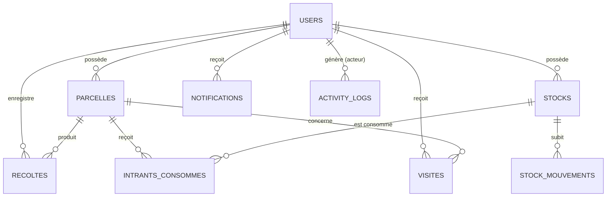

# SeneBI — Structure et Modèle de la Base de Données

Ce document décrit en détail le schéma de la base de données de **SeneBI**, les relations entre ses tables, le fonctionnement du générateur de données cohérentes (Seeder BI) et les requêtes SQL exécutées sous le capot.

---

## 📊 Modèle Conceptuel des Données (Relations)

Voici comment les entités de l'application sont liées entre elles :



---

## 🗂️ Description Détaillée des Tables

La base de données comporte **9 tables principales** gérées par les migrations Laravel dans `database/migrations/` :

### 1. `users` (Utilisateurs)
Contient les informations des managers et des agriculteurs.
* **`id`** (BIGINT, Clé primaire)
* **`name`** (VARCHAR) : Nom complet.
* **`email`** (VARCHAR, Unique) : Adresse email de connexion.
* **`password`** (VARCHAR) : Mot de passe sécurisé (hashé via Bcrypt).
* **`role`** (ENUM) : `'admin'`, `'manager'` ou `'client'`.
* **`status`** (VARCHAR) : Statut d'approbation (`'pending'`, `'approved'`, `'rejected'`).
* **`is_active`** (BOOLEAN) : Permet de bloquer temporairement l'accès à un compte.
* **`location`** (VARCHAR, Nullable) : Région d'exploitation (ex. Kaolack, Sikasso).
* **`company`** (VARCHAR, Nullable) : Nom de l'exploitation agricole.
* **`saison`** (VARCHAR, Nullable) : Saison en cours (ex. `'2026'`).

### 2. `parcelles` (Parcelles Agricoles)
Représente les terres cultivées par les agriculteurs.
* **`id`** (BIGINT, Clé primaire)
* **`user_id`** (BIGINT, Clé étrangère vers `users`) : Propriétaire de la parcelle.
* **`nom`** (VARCHAR) : Nom de la parcelle.
* **`surface`** (DOUBLE) : Taille de la parcelle en hectares (ha).
* **`culture`** (VARCHAR) : Type de culture plantée (`'Riz'`, `'Maïs'`, `'Coton'`).
* **`region`** (VARCHAR) : Région administrative.
* **`latitude` / `longitude`** (DOUBLE) : Coordonnées géographiques GPS pour la cartographie.

### 3. `recoltes` (Historique des Récoltes)
Enregistre les rendements et les données financières associées à chaque récolte par saison.
* **`id`** (BIGINT, Clé primaire)
* **`parcelle_id`** (BIGINT, Clé étrangère vers `parcelles`)
* **`user_id`** (BIGINT, Clé étrangère vers `users`)
* **`saison`** (VARCHAR) : Année/Saison de récolte (ex. `'2024'`, `'2026'`).
* **`quantite`** (DOUBLE) : Poids total récolté en kg.
* **`prix_unitaire`** (DOUBLE) : Prix de vente au kg en FCFA.
* **`revenu_total`** (DOUBLE) : Calculé automatiquement (`quantite * prix_unitaire`).
* **`couts_totaux`** (DOUBLE) : Coût d'exploitation (intrants consommés + frais de main-d'œuvre).
* **`benefice_net`** (DOUBLE) : Bénéfice réel dégagé (`revenu_total - couts_totaux`).

### 4. `stocks` (Gestion des Intrants en Stock)
Suivi en temps réel des intrants de chaque agriculteur.
* **`id`** (BIGINT, Clé primaire)
* **`user_id`** (BIGINT, Clé étrangère vers `users`)
* **`nom`** (VARCHAR) : Nom de l'intrant (ex. `'NPK'`, `'Urée'`, `'Semence Riz'`).
* **`type`** (VARCHAR) : Catégorie (`'Engrais'`, `'Semence'`, `'Pesticide'`).
* **`quantite_actuelle`** (DOUBLE) : Stock restant.
* **`seuil_critique`** (DOUBLE) : Niveau en dessous duquel une alerte de réapprovisionnement est déclenchée.
* **`cout_unitaire`** (DOUBLE) : Prix unitaire d'achat au kg ou au litre.

### 5. `stock_mouvements` (Journal des Stocks)
Historique complet des entrées (achats) et sorties (utilisations) d'intrants.
* **`id`** (BIGINT, Clé primaire)
* **`stock_id`** (BIGINT, Clé étrangère vers `stocks`)
* **`type`** (ENUM) : `'entree'` ou `'utilisation'`.
* **`quantite`** (DOUBLE) : Quantité mouvementée.
* **`quantite_avant` / `quantite_apres`** (DOUBLE) : Permet de recalculer et d'auditer l'état des stocks à un instant T.
* **`date_mouvement`** (TIMESTAMP)

### 6. `intrant_consommes` (Lien Consommation / Parcelle)
Associe précisément l'utilisation d'un stock d'intrant à une parcelle spécifique pour calculer les coûts de production de cette parcelle.
* **`id`** (BIGINT, Clé primaire)
* **`stock_id`** (BIGINT, Clé étrangère vers `stocks`)
* **`parcelle_id`** (BIGINT, Clé étrangère vers `parcelles`)
* **`quantite_consommee`** (DOUBLE)

### 7. `visites` (Suivi Terrain et Supervision)
Visites effectuées par les conseillers agricoles chez les agriculteurs.
* **`id`** (BIGINT, Clé primaire)
* **`user_id`** (BIGINT, Clé étrangère vers `users`) : L'agriculteur visité.
* **`action_effectuee`** (TEXT) : Compte rendu de la visite.
* **`recommandation`** (TEXT) : Conseils techniques formulés.
* **`date_visite`** (DATE) : Date de la visite (passée ou planifiée).
* **`duree`** (INTEGER) : Durée de la visite en minutes.

### 8. `notifications` & `activity_logs`
Tables de support système pour l'envoi d'alertes internes et l'historique d'audit des actions des managers.

---

## 🧠 Algorithme de Simulation de Données (Seeder BI)

Le fichier **[BiDataSeeder.php](file:///c:/wamp64/www/SeneBi_final/database/seeders/BiDataSeeder.php)** génère un jeu de données complet et cohérent pour les analyses décisionnelles. Il simule des situations réelles :

1. **Création des Agriculteurs :** Il s'assure de la présence de 9 agriculteurs répartis dans différentes localités (Kayes, Sikasso, Sikasso, Ségou, Mopti, Koulikoro, Bamako).
2. **Attribution de Stocks initiaux :** Chaque agriculteur reçoit un stock initial réaliste pour la saison (entre 1200 et 2500 kg/L par intrant).
3. **Simulations des Consommations :** En fonction de la surface de ses parcelles, le seeder déduit automatiquement du stock les intrants nécessaires (ex. 180kg de NPK par hectare de riz) et génère les mouvements de stock correspondants.
4. **Calcul de Rendements et Ventes :** Le seeder calcule des rendements logiques par hectare (ex. 5000 à 7200 kg de riz par hectare) vendus au prix du marché (350 FCFA/kg de riz, 280 FCFA/kg de maïs).
5. **Cas Particuliers Intentionnels (Alertes) :**
   * **Sécheresse et Rupture à Mopti :** Pour l'agriculteur basé à Mopti, le seeder met des stocks initiaux extrêmement bas pour déclencher l'alerte rouge et divise par 4 son rendement de récolte pour simuler une sécheresse, ce qui donne une rentabilité financière négative.
   * **Faible Activité à Ségou :** Pour l'agriculteur de Ségou, aucune visite récente n'est générée (la dernière visite remonte à plus de 3 mois) afin de le faire apparaître dans l'alerte "Faible activité de supervision".

---

## 🛠️ Exemples de requêtes SQL générées par Laravel

Voici les requêtes SQL de base exécutées par l'ORM Eloquent pour les actions courantes :

### 1. Inscription d'un utilisateur
```sql
INSERT INTO users (name, email, phone, company, location, password, role, status, is_active, created_at, updated_at) 
VALUES ('Sidi Keita', 'sidi@sidi-agri.ml', '771234567', 'Keita Agri', 'Kayes', '$2y$10$hash...', 'client', 'pending', 0, NOW(), NOW());
```

### 2. Approbation du compte par un Manager
```sql
UPDATE users 
SET is_active = 1, status = 'approved', approved_at = NOW(), approved_by = 1, updated_at = NOW() 
WHERE id = 5;
```

### 3. Suppression définitive d'un compte
```sql
DELETE FROM users WHERE id = 5;
```
